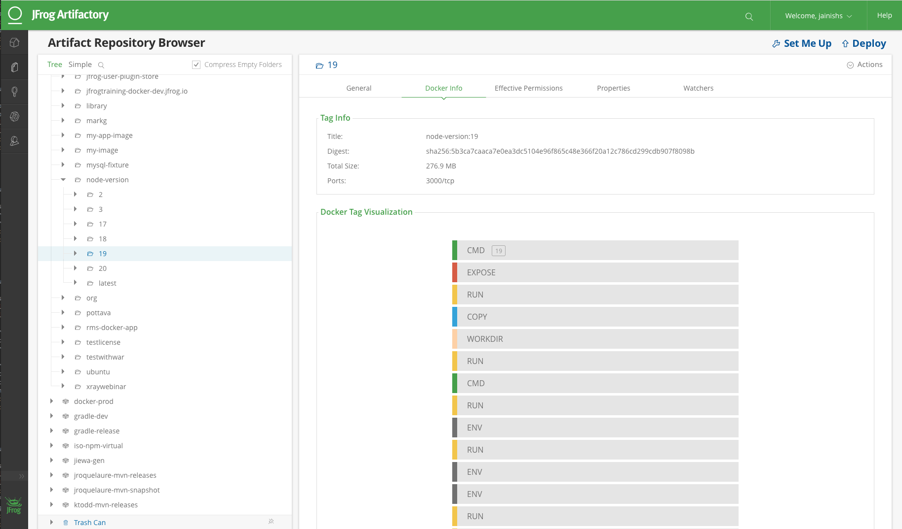

## Example Pipeline for CI/CD using Jenkins and Artifactory

#### Command to test npm package:
Install dependencies: `npm install` <Br>
Start node Server: `npm start` <Br>
Access Application on: [http://localhost:3000](http://localhost:3000)

#### Command to build docker image and push it to Artifactory:
Build docker image: ```docker build -t $DOCKER_REGISTRY/node-version .```<Br>
Run docker container: ```docker run -d -p 3000:3000 $DOCKER_REGISTRY/node-version```<Br>
Login to Artifactory docker registry: ```docker login -u ARTIFACTORY_USER -p $ARTIFACTORY_PASSWORD $DOCKER_REGISTRY```<Br>
Push docker image: ```docker push $DOCKER_REGISTRY/node-version```

#### Steps to create Jenkins Pipeline:
Let’s Create Jenkins Pipeline to build and push docker image to Artifactory:
1.  On the Jenkins front page, click on Credentials -> System -> Global credentials -> Add Credentials 
2.  Add your Artifactory credentials as the type Username with password, with the ID artifactory-credentials

3.  Add String Parameters:
    *   ART_SERVER_URL : Artifactory Server URL<Br>
		e.g `ART_SERVER_URL : https://jfrogtraining.jfrog.io/jfrogtraining`
    *   ART_DOCKER_REGISTRY -> Artifactory Docker Registry name<Br>
		e.g.  `ART_DOCKER_REGISTRY -> jfrogtraining-docker-dev.jfrog.io`
    *   CREDENTIAL_ID : Artifactory Credentials Id created in 4th step<Br>
	    e.g. `CREDENTIAL_ID -> artifactory-credentials`
4.  Create new Jenkins Pipeline Job.
5.  Copy [Jenkinsfile](Jenkinsfile) to Pipeline Script.
6.  To build it, press Build Now. After a few minutes you should see an image appear in your Artifactory repository, and something like this on the page of your new Jenkins job:

7.  Check your newly published docker image in Artifactory.

